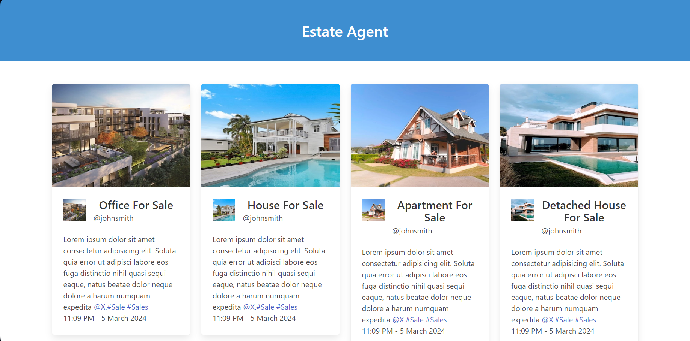

# Estate Agent Sales Website 🏠

This project is a simple sales website for an estate agent built with React and styled using Bulma.

## Live Demo
[Go to Website](https://react-props-estate-agent.vercel.app)




## Project Structure


  - **img/**: Folder containing image files.
    - `ico.svg`: Favicon image.
    - `preview.png`: Screenshot or preview image of the website.

- **src/**: React application source code.
  - `App.css`: CSS file for styling the React components.
  - `App.jsx`: Main React component that renders the sales listings.
  - `Course.jsx`: React component for displaying individual sales listings.

## Dependencies

- [React](https://reactjs.org/): JavaScript library for building user interfaces.
- [Bulma](https://bulma.io/): CSS framework for styling the website.

## Usage

1. **Clone the repository:**
   ```bash
   git clone https://github.com/your-username/estate-agent-sales.git
   cd estate-agent-sales
